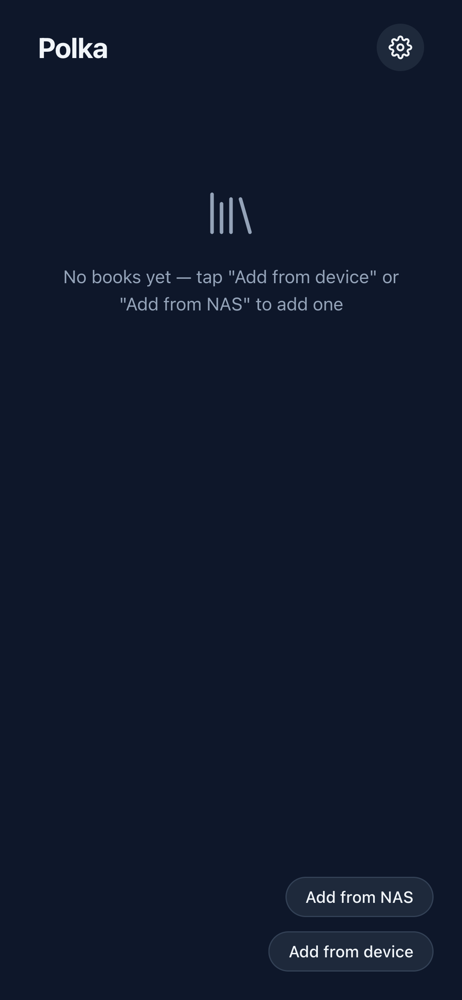
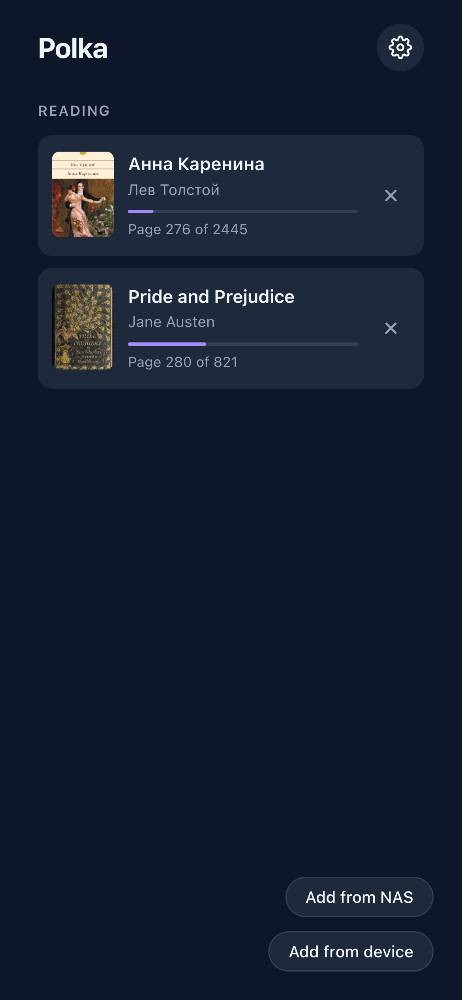
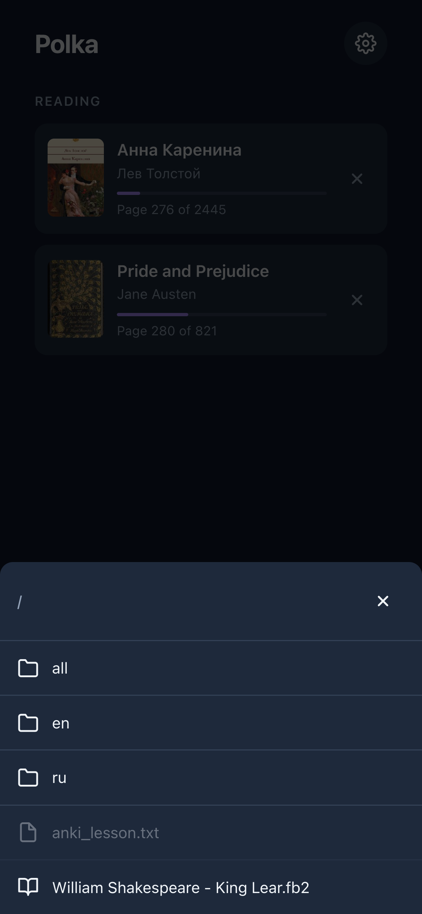
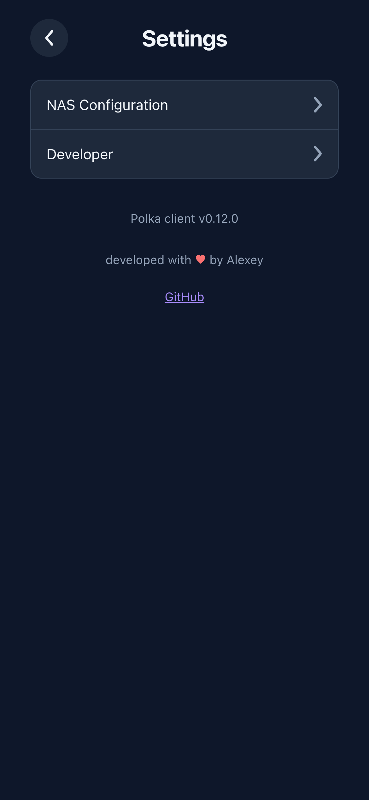
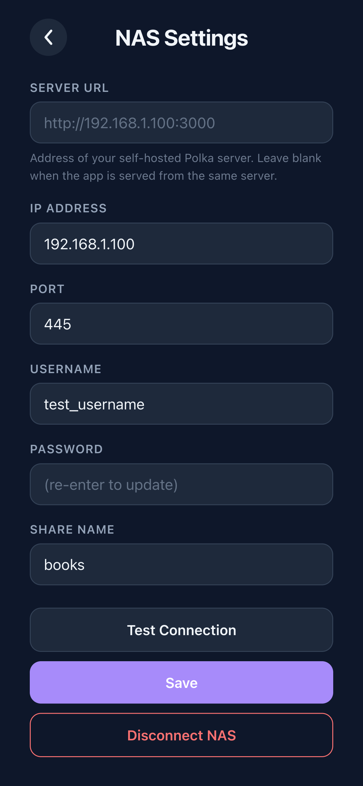
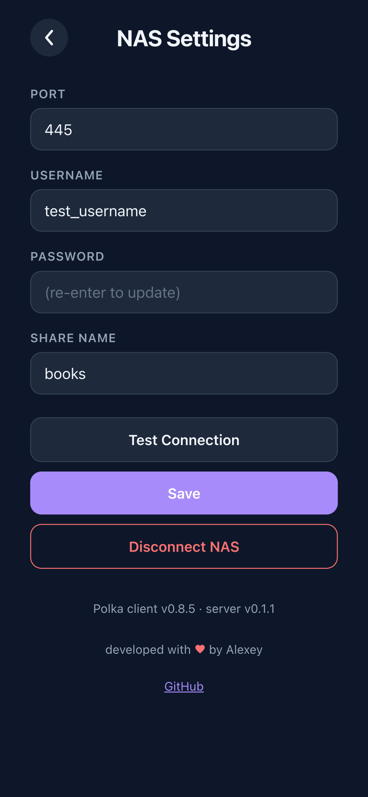
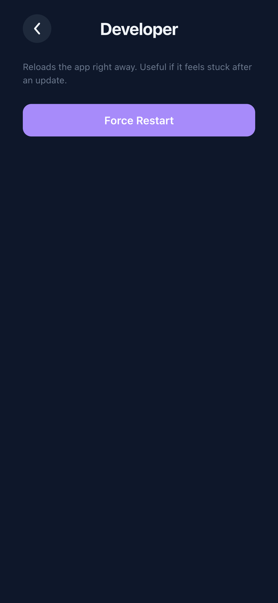
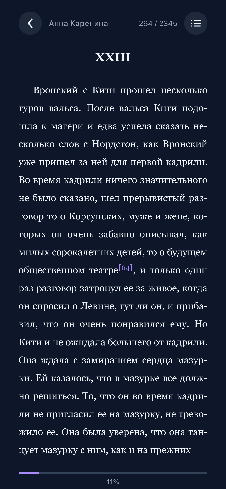
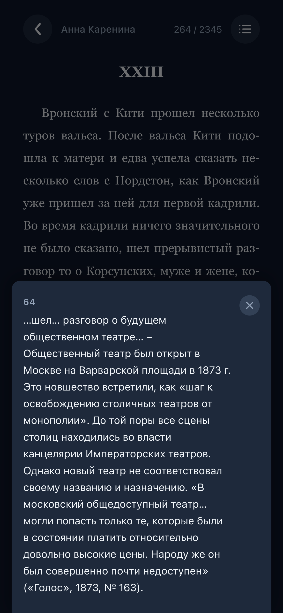
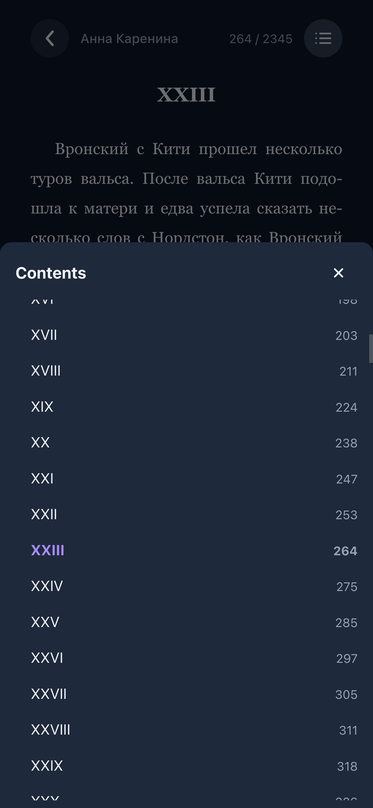

# Polka

> [!NOTE]
> The name comes from the Russian word **полка** (*polka*) — "shelf", as in a bookshelf.

A mobile-first e-book reader for EPUB and FB2 files, designed to run on TrueNAS. Browse your NAS book collection over SMB, or open files directly from your device. Progress is saved locally and optionally synced to the server.

<details>
<summary>Screenshots</summary>

           

</details>

## Features

- Read **EPUB** and **FB2** books
- **Open local files** directly from your device — no upload needed
- **Browse your NAS** via SMB and open books remotely
- **Books persist across reloads** — stored in IndexedDB, no re-download needed
- **Progress sync** — saved to IndexedDB and optionally synced to the server
- **Mobile-first** — swipe left/right to turn pages; keyboard arrows and spacebar also work
- **Reader navigation** — jump to any chapter from the table of contents; a progress bar shows how far along you are
- **Two-page spread on desktop** — wide screens (≥900px) show two pages side by side, like an open book
- **Page-based rendering** — only the current page is in the DOM, so even large books stay fast
- **Full-screen images** — tap a book illustration to view it full screen; close with the X button or Escape
- **Dark theme** — easy on the eyes for night reading
- **Installable as a PWA** — add to home screen; app shell works offline
- **Installable on TrueNAS SCALE** via Docker Compose
- **Developer settings** — a "Force Restart" option reloads the app right away, useful if it feels stuck after an update

See [docs/features.md](docs/features.md) for a detailed FB2 vs EPUB support matrix.

## Quick start (local dev)

```bash
git clone https://github.com/Beraliv/polka
cd polka

# Optional: bind-mount progress/SMB data to ./data so it's visible on the host
# (skip this to use Docker-managed named volumes instead)
cat > docker-compose.override.yml <<'EOF'
services:
  server:
    volumes:
      - ./data/progress:/data/progress
      - ./data/smb:/data/smb
EOF

docker compose up --build
```

Open `http://localhost:8080`, tap **Add from device** to open a local `.epub` or `.fb2` file. Override the port with the `CLIENT_PORT` env var (e.g. in a `.env` file — see `.env.example`).

Docker rebuilds the images on every `--build`, so this doesn't hot-reload — re-run `docker compose up --build` after code changes. See [CONTRIBUTING.md](CONTRIBUTING.md) for running tests, which still need a local Node install.

## NAS / TrueNAS deployment

```bash
docker compose up --build -d
```

The client is served on **port 8080** by default (override with `CLIENT_PORT`). API requests are proxied from nginx to the Node.js server on port 3001.

Progress JSON files are stored in a named Docker volume (`progress_data`) mounted at `/data/progress` inside the server container. Override the path with the `PROGRESS_PATH` env var.

SMB configuration is stored in a named Docker volume (`smb_config_data`) mounted at `/data/smb` inside the server container. Override the path with the `SMB_CONFIG_PATH` env var. The SMB password is AES-256-GCM encrypted before it's written; by default the server generates and stores its own key alongside the config, or you can supply your own via the `SMB_CONFIG_ENCRYPTION_KEY` env var for stronger protection (e.g. `openssl rand -hex 32`, kept outside the volume).

### TrueNAS SCALE

Polka installs as a two-container custom app via **Install via YAML** (the single-container Custom App form doesn't fit), pulling the CI-published `beraliv/polka-server` and `beraliv/polka-client` images from Docker Hub — full steps in the **[TrueNAS guide](docs/truenas.md)**.

## Install as PWA

### iOS (Safari)

1. Open the app URL in **Safari**
2. Tap the **Share** button (box with arrow pointing up)
3. Scroll down and tap **Add to Home Screen**
4. Confirm the name and tap **Add**

### Android (Chrome)

1. Open the app URL in **Chrome**
2. Tap the **⋮** menu → **Add to Home screen** (or tap the install prompt in the address bar)
3. Tap **Add**

The app opens full-screen without browser chrome. Books and progress are stored on-device in IndexedDB and available offline.

## SMB setup

1. Open the app and go to **Settings (⚙)**
2. Enter your NAS IP, port (default 445), username, password, and share name
3. Tap **Test Connection** to verify, then **Save**
4. Back on the home screen, tap **Add from NAS** to pick a book

Your NAS credentials are stored on the server, not in the browser, so the connection persists across devices and reloads without ever putting the password in client-side storage. The password is encrypted at rest on the server (see [NAS / TrueNAS deployment](#nas--truenas-deployment)). Books downloaded from the NAS are cached in IndexedDB and reopen instantly without re-downloading.

## Tech stack

| Layer | Choice |
|-------|--------|
| Client | SolidJS + Vite |
| Server | Node.js 24 (native TypeScript) + Fastify |
| EPUB parsing | fflate + DOMParser |
| FB2 parsing | DOMParser (FB2 is XML) |
| SMB | @marsaud/smb2 |
| Persistence | IndexedDB (idb) |
| PWA | vite-plugin-pwa + Workbox |
| Container | Docker + nginx |
